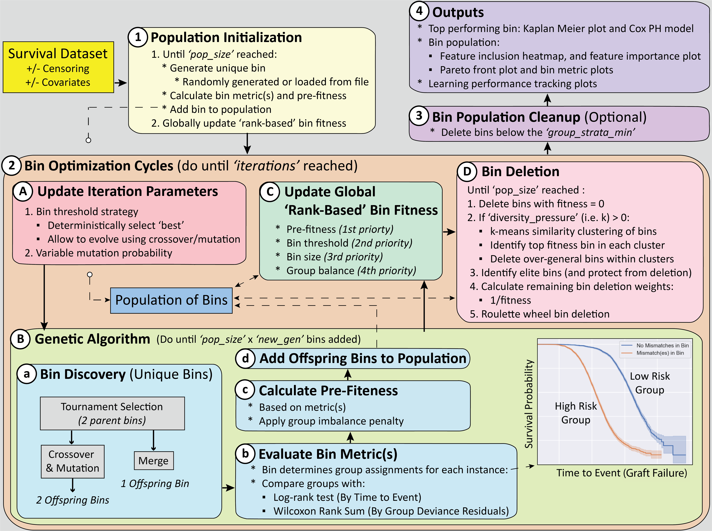

scikit-FIBERS
======================================

Overview
--------------------------------------
FIBERS (Feature Inclusion Bin Evolver for Risk Stratification) is an evolutionary machine learning algorithm designed for modeling and/or feature learning in survival data where the 'burden' (i.e. sum) of specific feature values in the dataset may be predictive of a time-to-event outcome (e.g. the burden of specific HLA amino-acid mismatches, between kidney donor and recipient pairs, being predictive of kidney graft failure time). FIBERS can be applied to survival datasets (1) with or without right-censoring, and (2) with or without target covariate features that need to be adjusted for. This implementation is scikit-learn compatible, thus we largely refer to it as scikit-FIBERS.

scikit-FIBERS can be used directly as a 'modeling strategy', by training a bin population and using the predict() function to apply the discovered bin with the highest fitness as a predictive model of risk group assigment. It can also be used as a 'feature learning algorithm', by training a bin population and using the transform() function to convert each discovered bin in the population into corresponding dataset features for additional downstream machine learning modeling. 

The scikit-FIBERS algorithm seeks to automatically identify and optimize a population of 'candidate bins' that maximize time-to-event differences between high and low risk groups. A 'bin' is a subset of features and an associated 'burden threshold' that together differentiate instances into high vs. low risk instance groups. Instances that have a bin sum (of feature values) greater than the threshold are assigend to the high-risk group, and all others to the low-risk group. The fitness (i.e. quality) of bins in the candidate bin population drives evolutionary algorithm learning. 

A schematic detailing how the scikit-FIBERS algorithm works is given below:

scikit-FIBERS currently offers three fitness function options: (1) 'log-rank fitness', for data without covariates, seeks to maximize the separation between high and low-risk survival curves (2) 'residuals fitness', for data with covariates, seeks to maximize the difference between deviance residuals between high and low-risk instance groups, and (3) 'product fitness', for data with covariates, calculates both log-rank and residuals metrics and assignes fitness as the product of both scores. 

Demonstration Jupyter Notebooks
--------------------------------------

Two Jupyter Notebooks have been included to demonstrate how scikit-FIBERS (and it's functions) can be applied to data with or without covariates. These demonstrations utilize two survival data simulators that are also included in the scikit-FIBERS repository (i.e. SIM1 and SIM2, for simulating right-censored survival data without or with covariates, respectively). 
* `FIBERS_Survival_Demo_SIM1 (no covariates)<https://github.com/UrbsLab/scikit-FIBERS/blob/main/FIBERS_Survival_Demo_SIM1.ipynb>`_
* `FIBERS_Survival_Demo_SIM2 (with covariates)<https://github.com/UrbsLab/scikit-FIBERS/blob/main/FIBERS_Survival_Demo_SIM2.ipynb>`_`

These notebooks are currently set up to run by downloading this repository and running the respective notebook. 

Documentation for FIBERS Class:
--------------------------------

Extensive code documentation about the scikit-FIBERS API can be found `here <skfibers.html#module-skfibers.fibers>`_.

Acknowledgements:
--------------------------------
The development of FIBERS benefited from feedback across multiple biomedical research collaborators at the University of Pennsylvania, Tulane University, and the Arbor Research Collaborative for Health. 

The bulk of the coding for the current version of FIBERS was completed by Ryan Urbanowicz and Harsh Bandhey, with credit to Satvik Dasariraju for his implementation of the original FIBERS 1.0 algorithm. Other algorithm/coding contributions have also made by Nolan Fogarty, Yi-An Hsieh, Sphia Sadek, Brian Ling, Gabe Lipschutz-Villa, and Praneel Vashney.

Funding supporting this work comes from NIH grant: R01 AI173095

Contact
-------------------------------

Please email Ryan.Urbanowicz@cshs.org and Harsh.Bandhey@cshs.org for any
inquiries related to scikit-FIBERS.

.. toctree::
   :maxdepth: 2
   :hidden:
   :caption: Table of Contents:

   self
   install
   data
   running
   parameters
   history
   citation
   modules

